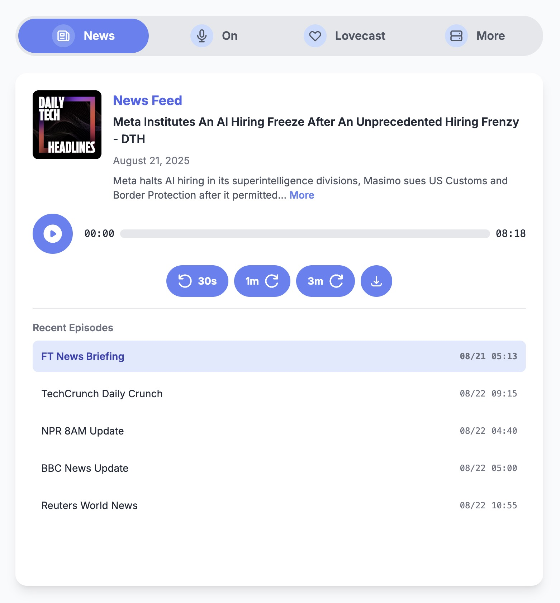

# Newsbear 🎧

Newsbear is a clean, responsive, single-page podcast player web application built with vanilla HTML, CSS (Tailwind CSS), and JavaScript. It fetches and parses public RSS feeds to create an elegant and easy-to-use listening experience right in your browser.

## ✨ Features

-   **Multi-Feed Support**: Easily switch between different podcasts using a sleek, animated tab bar.
-   **Dynamic Content**: Fetches podcast details and episode lists directly from RSS feeds.
-   **Aggregator Tab**: The special "News" tab combines the single latest episode from multiple news sources into one convenient feed.
-   **Full-Featured Player**: Includes standard audio controls:
    -   Play/Pause with pulsing animation
    -   Scrubbable progress bar
    -   Current time and total duration display
    -   Skip forward (1m, 3m) and backward (30s) buttons
    -   Download link for the current episode
-   **Episode Management**:
    -   Lists recent episodes for each podcast.
    -   Highlights the currently playing episode.
    -   Automatically plays the next episode in the list when the current one finishes.
-   **Playback Persistence**: Remembers your progress in an episode using the browser's `localStorage` and resumes from where you left off.
-   **Responsive Design**: A mobile-first design that scales beautifully to desktop screens.
-   **Modal Descriptions**: View full, rich-text episode descriptions in a clean pop-up modal.
-   **Error Handling**: Gracefully handles episodes with missing audio and attempts to play the next available one.
-   **Zero Dependencies**: Runs entirely in the browser with no build step or server-side code required.

## 🛠️ How It Works

The application is a single `index.html` file. Here's a breakdown of its operation:

1.  **RSS Fetching**: When the page loads, JavaScript fetches the XML content of the podcast RSS feeds specified in the HTML.
2.  **CORS Proxy**: To overcome browser cross-origin restrictions when fetching feeds from different domains, the app uses `https://corsproxy.io/` as a proxy.
3.  **XML Parsing**: The fetched XML data is parsed using the browser's built-in `DOMParser` API to extract podcast and episode information like titles, artwork, audio URLs, and descriptions.
4.  **Dynamic UI**: The parsed data is used to dynamically populate the UI, including the player details and the list of recent episodes.
5.  **Audio Control**: The standard HTML5 `<audio>` element is used for playback, with a custom UI built around it to provide a better user experience.
6.  **State Management**: Playback state (playing/paused) is managed via CSS classes, and episode progress is stored in `localStorage` with a key based on the episode's unique GUID.

## 🚀 Technologies Used

-   **HTML5**: The core structure of the web page.
-   **JavaScript (ES6+)**: All application logic is written in vanilla JavaScript with no external frameworks.
-   **Tailwind CSS**: A utility-first CSS framework for rapid UI development, loaded via CDN.
-   **Google Fonts**: Uses the "Inter" font for clean and modern typography.
-   **Heroicons**: For the icons used in the UI.

## 🔧 Setup & Installation

Since this project has no build process, setup is incredibly simple.

1.  Clone the repository:
    ```bash
    git clone [https://github.com/your-username/newsbear.git](https://github.com/your-username/newsbear.git)
    ```
2.  Navigate to the directory:
    ```bash
    cd newsbear
    ```
3.  Open the `index.html` file in your favorite web browser. That's it!

## 🎙️ How to Add or Change Podcasts

Customizing the podcasts is straightforward. All feed information is stored directly in the `data-feed-url` attributes within the HTML.

### To Change an Existing Podcast:

1.  Open `index.html` in a text editor.
2.  Find the player `div` you want to change (e.g., `id="player-2"`).
3.  Locate the `<audio>` element inside that `div`.
4.  Replace the URL in the `data-feed-url` attribute with the new podcast's RSS feed URL.

**Example (Changing Player 2):**

```html
<div id="player-2" class="... podcast-player ...">
    ...
    <audio class="hidden-audio" preload="metadata" data-feed-url="[https://feeds.megaphone.fm/VMP1684715893](https://feeds.megaphone.fm/VMP1684715893)"></audio> ...
</div>
```

### To Add a New Podcast:

You can add new podcasts to the "More" tab or create an entirely new tab.

1.  **Copy an existing player's HTML block**: Find a block like `<div id="player-X" ...> ... </div>` and copy the entire thing.
2.  **Assign a new ID**: Change the `id` of the copied `div` to a new, unique value (e.g., `id="player-6"`).
3.  **Update the feed URL**: Change the `data-feed-url` in the new block to your desired RSS feed.
4.  **Add it to the UI**:
    -   To add it to the "More" tab, copy one of the `<button>` elements inside `<div id="more-podcast-list">` and update its `data-player-target` to match your new player's ID.
    -   To add a new main tab, you will need to copy a `<button id="tab-X">` element and adjust the JavaScript in the `<script>` block to handle the new tab and player.

## 📄 License

This project is open source and available under the [MIT License](LICENSE).
<br><br>
